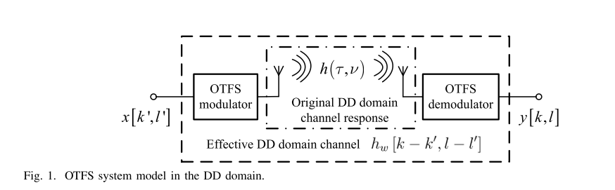
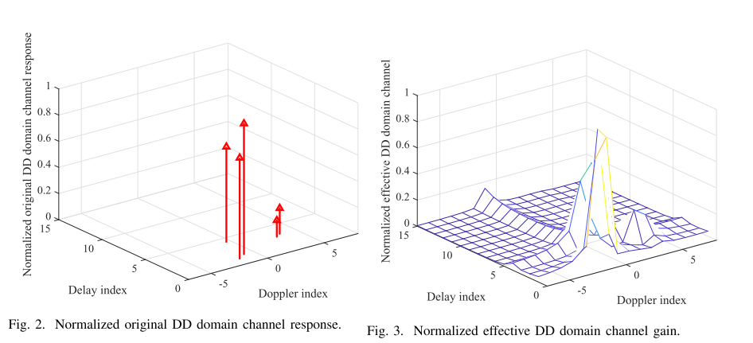

# OTFS_channel_estimation

### 介绍
这是一个考虑分数时延和分数多普勒的SISO-OTFS通信系统以及一个基于嵌入式单导频的OTFS信道估计代码
#### DD域信道模型
为便于表述，如图1所示，我们直接给出文献[1][6][8][12]中推导的OTFS系统时延-多普勒（DD）域输入-输出关系：

$$ y[k, l]=\sum_{k^{\prime}=0}^{N-1}\sum_{l^{\prime}=0}^{M-1} x\left[k^{\prime}, l^{\prime}\right] h_w\left[k-k^{\prime}, l-l^{\prime}\right]+z[k, l],(1)$$

其中 $x\left[k^{\prime}, l^{\prime}\right]\in A$ 是DD域网格点 $\left[k^{\prime}, l^{\prime}\right]$ 上的调制符号，$y[k, l]\in C$ 表示DD域接收信号的 $[k, l]$ 采样点。变量 $z[k, l]$ 为加性噪声，其分布取决于接收端加窗方式[6]。例如采用矩形窗时，$z[k, l]\sim\mathcal{C}\mathcal{N}\left(0,\sigma^{2}\right)$，其中 $\sigma^{2}$ 为未知噪声功率[6]。整数N表示时隙数（每个时隙时长T），故OTFS帧时长为NT；整数M表示子载波数（子载波间隔 $\Delta_{f}$），系统总带宽为 $M\Delta_{f}$。细节推导可参阅我们前期工作[6]中的$(1)^{1}$。

式(1)中，$h_{w}\left[k-k^{\prime}, l-l^{\prime}\right]$ 是通过对原始DD域信道响应采样得到的有效DD域信道。原始DD域信道响应表示为：

$$h(\nu,\tau)=\sum_{i=1}^{P} h_{i}\delta\left(\nu-\nu_{i}\right)\delta\left(\tau-\tau_{i}\right),(2)$$

其中P为信道路径数，$h_{i}$ 为第i条路径的系数，$\delta(\cdot)$ 是狄拉克函数。$\tau_{i}\in\left(0,\tau_{\max}\right)$ 和 $\nu_{i}\in\left(-\nu_{\max},\nu_{\max}\right)$ 分别表示第i条路径的时延和多普勒频移。$\nu_{\max}$ 和 $\tau_{\max}$ 分别代表传播环境中的最大多普勒频移和最大时延，与收发端最大相对速度或散射体最大传播距离相关。本文假设路径数P未知，但通过所提信道估计方法可先验获取 $\nu_{\max}$ 和 $\tau_{\max}$。实际中可通过长期测量经验性获得边界值，即 $\nu_{\max}=\max_{i}\left\{\left|\nu_{i}\right|\right\}$ 和 $\tau_{\max}=\max_{i}\left\{\tau_{i}\right\}$。而信道实现中的路径数主要取决于传播环境中的散射体分布，通常不可预测。

有效DD域信道可表示为[1][6][8][12]：

$$\begin{align*}& h_w\left[k-k^{\prime}, l-l^{\prime}\right]=\sum_{i=1}^{P} h_iw\left(k-k^{\prime}-k_{\nu_i}, l-l^{\prime}-l_{\tau_i}\right)e^{-j2\pi\nu_i l_{\tau_i}}=\sum_{i=1}^{P}\tilde{h}_iw\left(k-k^{\prime}-k_{\nu_i}, l-l^{\prime}-l_{\tau_i}\right),\text{(3)}\end{align*}$$

其中 $k, k^{\prime}\in\left\{0,\ldots, N-1\right\}, l, l^{\prime}\in\left\{0,\ldots, M-1\right\}$，归一化参数 $k_{\nu_{i}}=\nu_{i} N T\in R$ 和 $l_{\tau_{i}}=\tau_{i} M\Delta_{f}\in$ R。为便于信道估计，将相位项 $e^{-j 2\pi\nu_{i} l_{\tau_{i}}}$ 吸收进信道系数 $\tilde{h}_{i}=h_{i} e^{-j 2\pi\nu_{i} l_{\tau_{i}}}$，因为时延与多普勒变量在指数函数中不可分离。

式(3)中，采样函数 $w\left(k-k^{\prime}-k_{\nu}, l-l^{\prime}-l_{\tau}\right)$ 捕获了原始DD域信道响应的多普勒/时移、脉冲成形滤波器以及OTFS调制解调器中时频域加窗的联合效应（图1），其表达式为[6][12]：

$$\begin{align*}&w\left(k-k^{\prime}-k_{\nu},l-l^{\prime}-l_{\tau}\right)\\ =&\frac{1}{NM}\sum_{n=0}^{N-1}\sum_{m=0}\sum_{m^{\prime}\neq m}^{M-1}A_{g_{rx}g_{tx}}\left(-l_{\tau}\frac{1}{M\Delta f},\left(m-m^{\prime}\right)\Delta f-k_{\nu}\frac{1}{NT}\right)\\ &\times U\left[n,m^{\prime}\right]V\left[n,m^{\prime}\right]e^{-j2\pi\frac{n\left(k-k^{\prime}-k_{\nu}\right)}{N}}e^{-j2\pi\frac{\left(m l-m^{\prime}l^{\prime}-m^{\prime}l_{\tau}\right)}{M}}\\ &+e^{-j2\pi\frac{k^{\prime}}{N}}\frac{1}{NM}\sum_{n=1}^{N-1}\sum_{m=0}^{M-1}\sum_{m^{\prime}=0}^{M-1}A_{g_{rx}g_{tx}}\left(T-l_{\tau}\frac{1}{M\Delta f},\left(m-m^{\prime}\right)\Delta f-k_{\nu}\frac{1}{NT}\right)\\ &\times U\left[n-1,m^{\prime}\right]V\left[n-1,m^{\prime}\right]e^{-j2\pi\frac{n\left(k-k^{\prime}-k_{\nu}\right)}{N}}e^{-j2\pi\frac{\left(m l-m^{\prime}l^{\prime}-m^{\prime}l_{\tau}\right)}{M}},\end{align*},(4)$$

$U[n, m]$ 和 $V[n, m]$ 分别表示时频域 $[n, m]$ 点的发射窗和接收窗。发射脉冲成形滤波器 $g_{tx}(t)$ 与接收滤波器 $g_{rx}(t)$ 的模糊函数定义为：

$$A_{g_{rx} g_{tx}}(\tau,\nu)=\int_{t} g_{tx}(t) g_{rx}^{*}(t-\tau) e^{-j 2\pi\nu(t-\tau)} d t.\qquad(5)$$

需注意，(1)-(4)式是通用框架，适用于任意脉冲成形滤波器和时频域加窗。式(4)显示采样函数在多普勒域和时延域分别具有周期N和M的循环结构，因此有效DD域信道 $h_{w}\left[k-k^{\prime}, l-l^{\prime}\right]$ 也呈现相同循环特性，即 $h_{w}\left[k-k^{\prime}, l-l^{\prime}\right]=h_{w}\left[\left(k-k^{\prime}\right)_{N},\left(l-l^{\prime}\right)_{M}\right]$。

OTFS文献中常见研究案例是采用理想脉冲成形滤波器[12]，其满足双正交条件[6]：

$$\begin{align*}& A_{g_{r x} g_{t x}}\left(\left(n-n^{\prime}\right) T-l_\tau\frac{1}{M\Delta f},\left(m-m^{\prime}\right)\Delta f-k_\nu\frac{1}{N T}\right)=q_{\tau_{\max}}(t-n T) q_{\nu_{\max}}(f-m\Delta f),\\ &\text{ with}\end{align*},(6)$$

其中

$$\begin{align*}&\text{ with}\\ & q_{\tau_{\max}}(t-n T)=\left\{\begin{array}{cc}\delta[n]&|t-n T|\leq\tau_{\max},\\ q(t)&\text{ otherwise}\end{array}\quad\text{ and} q_{\nu_{\max}}(f-m\Delta f)=\left\{\begin{array}{cc}\delta[m]&|f-m\Delta f|\leq\nu_{\max},\\ q(t)&\text{ otherwise}\end{array}\right.\right.\\ &\end{align*},(7)$$

$q(x)$ 为任意函数。进一步采用矩形时频窗[6]（$U[n, m]=V[n, m]=1,\forall m, n$）时，式(4)可简化为：

$$w\left(k-k^{\prime}-k_{\nu}, l-l^{\prime}-l_{\tau}\right)=w_{\nu}\left(k-k^{\prime}-k_{\nu}\right) w_{\tau}\left(l-l^{\prime}-l_{\tau}\right),(8)$$

其中多普勒域和时延域采样函数分别为：

$$\begin{align*}w_\nu\left(k-k^{\prime}-k_\nu\right)&=\frac{1}{N}\left[e^{-j(N-1)\pi\frac{k-k^{\prime}-k_\nu}{N}}\frac{\sin\left(\pi\left(k-k^{\prime}-k_\nu\right)\right)}{\sin\left(\frac{\pi\left(k-k^{\prime}-k_\nu\right)}{N}\right)}\right]\text{ 和}\\ w_\tau\left(l-l^{\prime}-l_\tau\right)&=\frac{1}{M}\left[e^{-j(M-1)\pi\frac{l-l^{\prime}-l_\tau}{M}}\frac{\sin\left(\pi\left(l-l^{\prime}-l_\tau\right)\right)}{\sin\left(\frac{\pi\left(l-l^{\prime}-l_\tau\right)}{M}\right)}\right],\end{align*}\qquad(9)$$

本文主要讨论理想脉冲成形和矩形窗情形。所提信道估计算法可通过修改式(4)的采样函数推广至任意脉冲成形和加窗场景。

为展示原始DD域信道响应与有效DD域信道的差异，图2和图3分别给出了$M=N=16$、$P=5$时的归一化信道增益。可见原始DD域信道响应确实稀疏。但由于分数多普勒和时延（非整数$k_{\nu}$和$l_{\tau}$）的存在，即使采用理想脉冲成形滤波器，(9)式在$k-k^{\prime}\neq k_{\nu}$和$l-l^{\prime}\neq l_{\tau}$时仍非零。这导致式(3)的有效DD域信道出现扩散现象，不再稀疏。因此采用压缩感知技术[7][9]直接估计有效DD域信道性能不佳。本文提出直接估计原始DD域信道响应$h(\nu,\tau)$，再通过式(3)重构有效DD域信道，这是实现高效数据检测的关键。

#### 基于阈值的信道估计算法
写的太累了，自己看论文 (P. Raviteja, K. T. Phan, and Y. Hong, “Embedded pilot-aided channel estimation for otfs in delay–doppler channels,” IEEE Transactions on Vehicular Technology, vol. PP, no. 99, pp. 1–1, 2019.)去吧
### 各模块介绍
主函数入口：main.m——完成DD域矩阵经过DD域信道得到DD域输出矩阵的过程，并在过程中插入导频和进行信道估计
DD域信道估计相关：DD_Channel_Output.m（输出矩阵表达式）、h_omega.m（DD域信道有效响应）、omega_nu.m（$\omega_{\nu}$）、omega_tau.m（$\omega_{\tau}$）
信道估计模块：Insert_Pilot.m（插入导频）、martix_for_CE.m（输出端获取导频信息）、Yu_zhi_est.m（基于阈值的信道估计方法）、get_parameters.m（根据有效响应估计值还原参数）、calculate_NMSE.m（计算归一化均方误差）